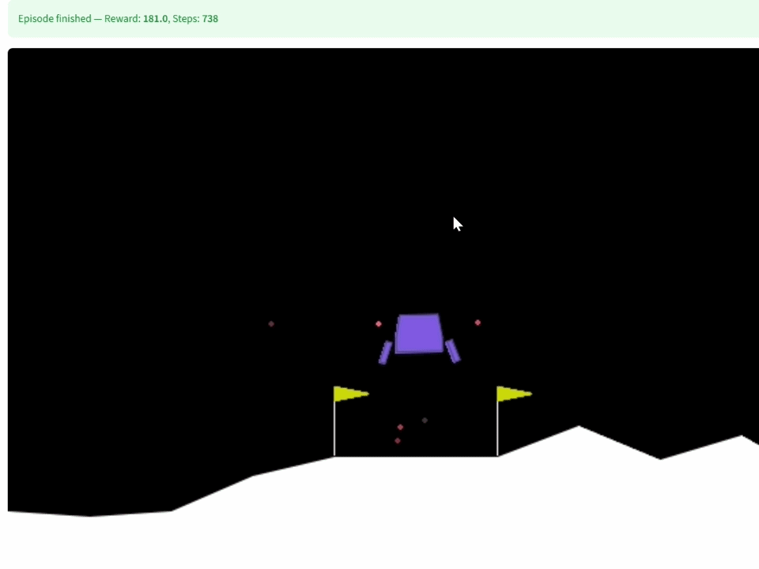
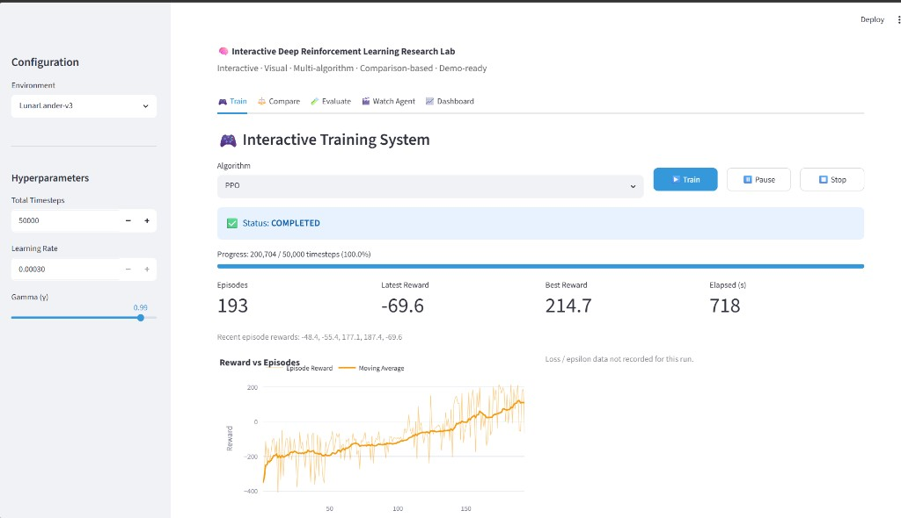
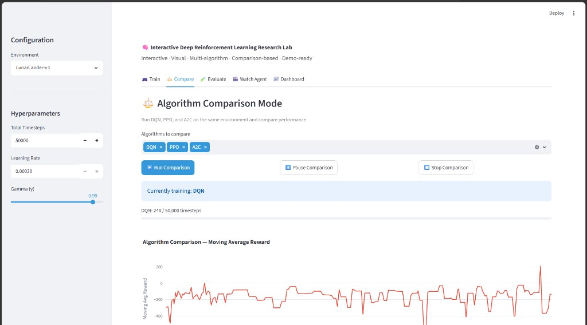
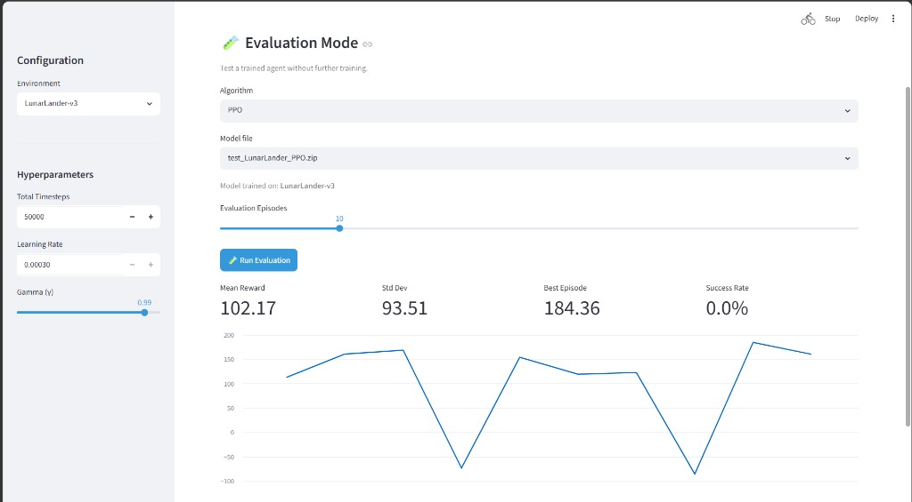
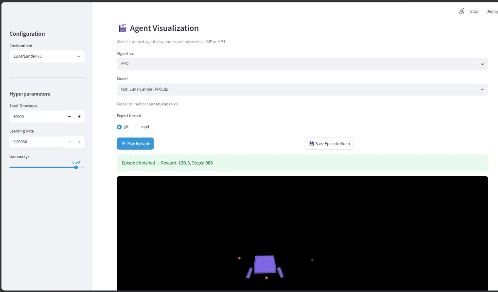
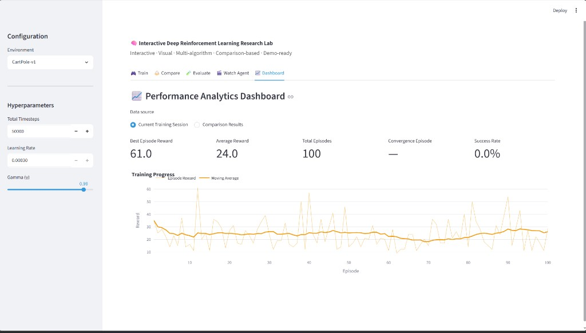

# 🧠 Interactive Deep Reinforcement Learning Research Lab

An interactive, visual, multi-algorithm reinforcement learning lab built on **Stable Baselines 3**. Train, compare, evaluate, and watch DQN, PPO, and A2C agents on classic control environments — all from a demo-ready web UI.

[](https://github.com/AmineElAtrache/Interactive-Deep-Reinforcement-Learning-Lab/actions/workflows/ci.yml)
[](https://github.com/AmineElAtrache/Interactive-Deep-Reinforcement-Learning-Lab/actions/workflows/cd.yml)
[](LICENSE)

Repository: [github.com/AmineElAtrache/Interactive-Deep-Reinforcement-Learning-Lab](https://github.com/AmineElAtrache/Interactive-Deep-Reinforcement-Learning-Lab)

## Demo

**LunarLander-v3** — trained PPO agent landing successfully:



## Screenshots

### 🎮 Train — live progress & reward curves



### ⚖️ Compare — DQN vs PPO vs A2C



### 🧪 Evaluate — multi-episode testing



### 🎬 Watch Agent — real-time rendering



### 📈 Dashboard — training analytics



## Features

| Feature | Description |
|---------|-------------|
| 🎮 **Interactive Training** | Select environment, algorithm, and hyperparameters; train with one click |
| ▶️ **Live Progress** | Real-time reward curves, pause/stop controls |
| 🧠 **Multi-Algorithm** | DQN, PPO, A2C |
| 📊 **Live Visualization** | Reward, moving average, loss, epsilon decay |
| ⚖️ **Comparison Mode** | Run all algorithms on the same env; compare reward, stability, speed |
| 🎬 **Agent Visualization** | Watch trained agents play; export GIF/MP4 |
| 💾 **Model Save/Load** | Persist and reload trained models locally |
| 📈 **Analytics Dashboard** | Best reward, convergence, success rate |
| 🧪 **Evaluation Mode** | Test agents over multiple episodes without training |

## Prerequisites

- Python 3.8+
- [uv](https://docs.astral.sh/uv/getting-started/installation/) package manager

## Quick Start

```bash
git clone https://github.com/AmineElAtrache/Interactive-Deep-Reinforcement-Learning-Lab.git
cd Interactive-Deep-Reinforcement-Learning-Lab
uv sync
uv run streamlit run app.py
```

Open **http://localhost:8501** in your browser.

## Environments

| Environment | Description | Tip |
|-------------|-------------|-----|
| **CartPole-v1** | Balance a pole on a cart | Fast to train — good for demos |
| **LunarLander-v3** | Land a spacecraft safely | Slower — use 50k+ timesteps |

> Models are environment-specific. A CartPole model cannot run on LunarLander (and vice versa).

## CI/CD

### Continuous Integration (CI)

Runs on every push and pull request to `main` / `master`:

- **Ruff** lint and format check
- **Compile** all Python modules
- **Pytest** smoke tests (env reset, model creation — no full training)

Run locally:

```bash
uv sync --group dev
uv run ruff check .
uv run ruff format --check .
uv run pytest tests/ -v
```

### Continuous Deployment (CD)

Runs on push to `main` / `master` and version tags (`v*`):

1. **Docker** — builds and pushes to [GitHub Container Registry](https://docs.github.com/en/packages/working-with-a-github-packages-registry/working-with-the-container-registry)
2. **Verify** — confirms the Streamlit app loads after deploy

```bash
docker pull ghcr.io/amineelatrache/interactive-deep-reinforcement-learning-lab:latest
docker run -p 8501:8501 ghcr.io/amineelatrache/interactive-deep-reinforcement-learning-lab:latest
```

### Streamlit Community Cloud (optional)

1. Push this repo to GitHub
2. Go to [share.streamlit.io](https://share.streamlit.io)
3. Connect the repo — main file: `app.py`

## CLI (Legacy)

```bash
uv run python train_models.py 25          # Batch-train all algorithms
uv run tensorboard --logdir=logs          # TensorBoard metrics
uv run python load_model.py PPO 50000.zip # Render a saved model
```

## Project Structure

```
├── app.py              # Streamlit interactive lab UI
├── config.py           # Paths, environments, defaults
├── docs/               # README screenshots & demo GIF
├── pyproject.toml      # Dependencies (uv)
├── Dockerfile          # Container image for CD
├── .github/workflows/  # CI & CD pipelines
├── tests/              # Smoke tests
├── core/               # Training, comparison, evaluation, visualization
├── models/             # Saved model checkpoints
├── logs/               # TensorBoard logs
└── exports/            # Exported GIF/MP4 episodes
```

## License

This project is licensed under the [MIT License](LICENSE).

## Resources

1. [Stable Baselines 3 Documentation](https://stable-baselines3.readthedocs.io/)
2. [Gymnasium Environments](https://gymnasium.farama.org/)
3. [Streamlit Documentation](https://docs.streamlit.io/)
4. [uv Documentation](https://docs.astral.sh/uv/)
